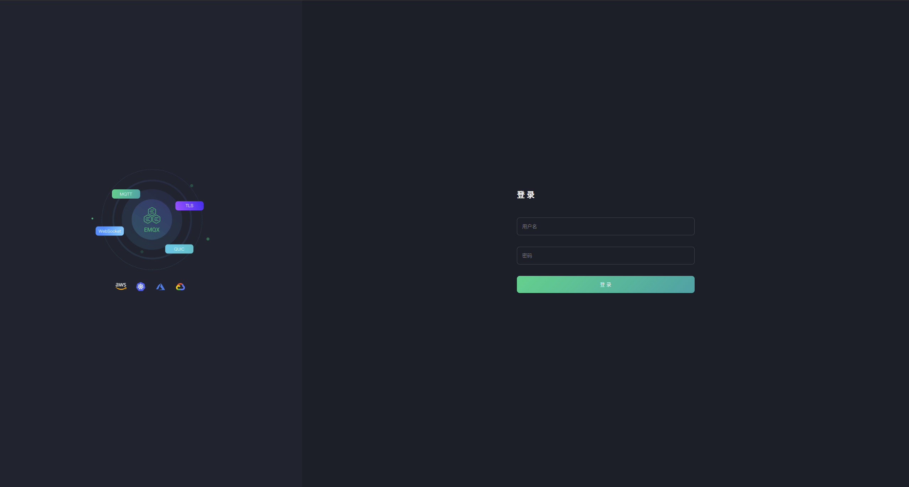

# Matrix-Dynamics

此项目为北京林业大学-东方瑞通实训项目，以下为项目详情：

## 一.项目平台 :fa-star: 

### 1.基本要求
1. ubuntu20.04 版本云服务器 （本项目使用服务器 x 3）
2. MySQL8.0 版本云数据库
3. stm32
4. esp32 cam s2
5. openmv4 plus
### 2.开发软件

1. vscode
2. pycharm 2022专业版
3. solidworks 2020

## 二、项目目录 :fa-th-list: 


```
.
├── Back-end              后端代码（前端已集成）                       
│   ├── app.py
│   ├── blueprints
│   ├── config.py
│   ├── decorators.py
│   ├── exts.py
│   ├── migrations
│   ├── models.py
│   ├── MQTT
│   ├── Mqtt_demo
│   ├── __pycache__
│   ├── requirements.txt
│   ├── static
│   ├── templates
│   ├── test.txt
│   └── venv
├── Front-end              前端代码
│   ├── about
│   ├── devicebounded1
│   ├── devicebounded2-4
│   ├── exit
│   ├── get_back_password
│   ├── index
│   ├── purchase
│   ├── register_1
│   └── team
├── Hardware               硬件代码
│   ├── MQTTWcarV1_demo    esp32cam代码
│   ├── openmv             openmv4plus部分代码
│   └── WaterCar_STM32     stm32代码
├── LICENSE
├── Mqtt_demo              mqtt通讯demo
│   ├── pub.py
│   ├── __pycache__
│   ├── sub.py
│   └── test.py
├── README.md
├── Solidworks-drawings    小车solidworks建模文件
│   ├── 9G舵机.SLDPRT
│   ├── 成品1
│   ├── 履带底盘.SLDPRT
│   ├── 水泵.SLDPRT
│   ├── 液位传感器.SLDPRT
│   ├── ESP32-CAM.SLDPRT
│   └── GPS天线.SLDPRT

```
## 三、服务器部署
本项目皆使用腾讯云服务器
### 1.mqtt服务器
首先要在服务器开启1883和18083端口

打开终端执行以下命令
```
wget https://www.emqx.io/downloads/broker/v4.0.5/emqx-ubuntu16.04-v4.0.5.zip
```
解压EMQ X Broker
```
unzip emqx-ubuntu16.04-v4.0.5.zip
```
进入解压出来的emqx文件夹，使用命令启动即可
```
sudo ./bin/emqx start
```
在浏览器输入服务器公网ip加18083即可进入后端管理界面
```
ip:18083
```

默认账号为admin

密码为public
### 2.obs服务器

### 3.database服务器
### 4.web服务器（主服务器）
